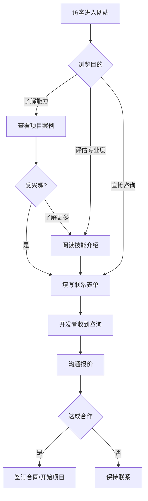

# 个人开发者接单网站 - 产品需求文档

## 1. 产品概述

专为个人开发者打造的接单展示网站，帮助开发者展示过往项目经验与技术实力，获取潜在客户咨询与项目合作机会。面向有软件开发需求的中小企业主、项目经理及创业团队，通过专业的项目案例展示和清晰的联系方式，促进商务合作。

核心价值：
- 建立专业形象，提升客户信任度
- 集中展示项目经验与技术能力
- 提供便捷的客户咨询通道

## 2. 核心功能

### 2.1 页面结构

| 页面 | 核心模块 |
|------|----------|
| 首页 | 品牌展示、技能标签、精选项目、快速联系入口 |
| 项目展示 | 分类筛选、项目卡片、项目详情 |
| 关于我 | 个人简介、技术栈、经验年限、服务流程 |
| 联系合作 | 联系方式、表单咨询、服务定价 |

### 2.2 模块详细说明

#### 首页模块
- **Hero 区域**：个人品牌标语 + 核心定位 + CTA 按钮
- **技能展示**：使用标签云形式展示技术栈（Vue/React/Node/Python 等）
- **精选项目**：3-4 个代表性项目卡片展示，点击跳转详情
- **服务优势**：简洁的优势列表（效率、质量、沟通）
- **快速联系**：浮动或固定联系按钮

#### 项目展示模块
- **分类筛选**：全部/园区/工厂/官网/管理后台/可视化
- **项目卡片**：
  - 项目封面图
  - 项目名称
  - 项目类型标签
  - 简短描述
  - 核心技术栈
- **项目详情弹窗/页面**：
  - 项目封面大图
  - 项目背景与需求
  - 技术方案
  - 核心功能
  - 技术栈详情
  - 项目截图

#### 关于我模块
- **个人照片**：真实或抽象头像
- **简介文字**：开发者身份、专注领域、经验年限
- **技术栈详情**：按类别分组展示（前端/后端/数据库/部署）
- **服务流程**：需求沟通 → 方案确认 → 项目执行 → 交付验收

#### 联系合作模块
- **联系方式**：
  - 微信/邮箱/电话
  - 社交媒体链接
- **咨询表单**：
  - 姓名/公司
  - 联系方式
  - 项目类型选择
  - 项目描述
  - 预算范围
  - 预期时间
- **服务定价**（可选）：
  - 按项目类型的大致报价区间

## 3. 用户流程



## 4. 设计风格

### 4.1 视觉风格
- **整体调性**：专业、可靠、现代、简洁
- **设计关键词**：技术感、商业化、清晰、值得信赖
- **氛围**：偏深色主题（代码/技术感），配合明亮点缀色

### 4.2 色彩方案
- **主色调**：深灰蓝 `#1a1f36` 或深紫 `#2d1b4e`
- **次要色**：`#6366f1`（靛蓝）或 `#8b5cf6`（紫色）
- **强调色**：`#22c55e`（绿色，用于成功/CTA）
- **背景色**：深色 `#0f172a`，浅色 `#f8fafc`
- **文字色**：白色 `#ffffff`、灰色 `#94a3b8`

### 4.3 字体选择
- **标题字体**：Noto Sans SC（中文）/ Space Grotesk（英文）
- **正文字体**：Noto Sans SC（中文）/ Inter（英文）
- **代码展示**：JetBrains Mono

### 4.4 布局风格
- **整体布局**：单页面滚动式
- **卡片设计**：圆角卡片 + 微妙阴影 + 悬停动效
- **间距**：宽松留白，模块间距 80-120px
- **响应式**：桌面优先，移动端适配

### 4.5 动效设计
- **页面加载**：渐入动画，错落有致
- **悬停效果**：卡片上浮 + 阴影加深
- **滚动触发**：元素滑入视口时淡入
- **按钮交互**：点击波纹 + 颜色过渡

## 5. 项目分类标签

| 类型 | 标签 | 示例场景 |
|------|------|----------|
| 园区系统 | 智慧园区、工业园区 | 园区管理、设施监控 |
| 工厂系统 | MES、WMS、智能制造 | 生产管理、仓储系统 |
| 企业官网 | 官网、品牌网站 | 企业展示、营销落地页 |
| 管理后台 | SaaS、ERP、CRM | 数据管理、运营系统 |
| 数据可视化 | Dashboard、大屏 | 数据监控、BI 分析 |

## 6. 技术实现

### 6.1 技术栈
- **框架**：React 18 + Vite
- **样式**：Tailwind CSS
- **动画**：Framer Motion
- **图标**：Lucide React
- **字体**：Google Fonts（Noto Sans SC + Space Grotesk）

### 6.2 项目结构
```
/src
  /components
    /Header - 导航栏
    /Hero - 首屏区域
    /Skills - 技能展示
    /Projects - 项目展示
    /About - 关于我
    /Contact - 联系表单
    /Footer - 页脚
  /data
    projects.js - 项目数据
    skills.js - 技能数据
  /hooks
    useScrollAnimation.js - 滚动动画
  App.jsx
  main.jsx
  index.css
```

### 6.3 数据管理
- 所有数据使用静态 JSON/JS 文件管理
- 无后端依赖，纯前端展示
- 联系方式使用表单提交（可对接邮件服务）

## 7. 验收标准

### 功能验收
- [ ] 首页完整展示，包括 Hero、技能、精选项目
- [ ] 项目展示支持分类筛选
- [ ] 项目详情可正常查看
- [ ] 联系表单可填写并提交
- [ ] 所有交互按钮可正常响应
- [ ] 移动端布局正常

### 视觉验收
- [ ] 整体风格统一，颜色搭配协调
- [ ] 动画效果流畅自然
- [ ] 字体加载正常，显示清晰
- [ ] 响应式布局在不同设备下表现良好
- [ ] 无明显布局错位或元素重叠
