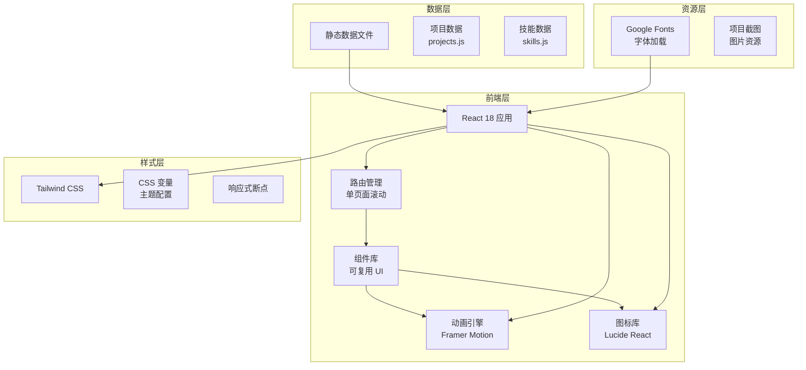
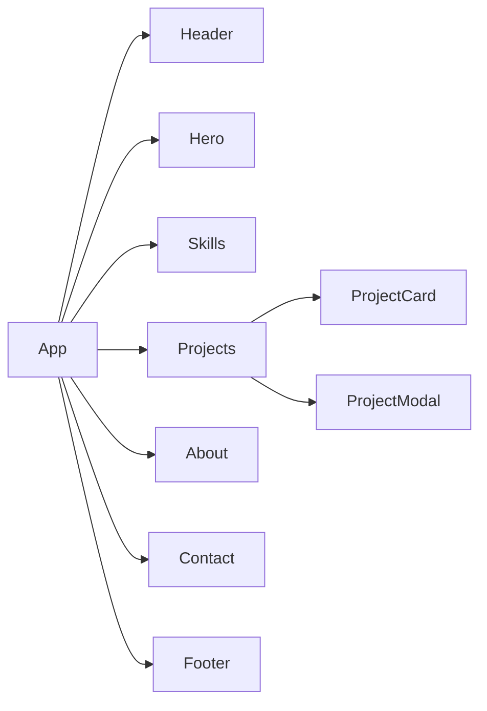

# 个人开发者接单网站 - 技术架构文档

## 1. 架构设计



**架构说明**：
- 采用单页面应用（SPA）架构，用户滚动浏览不同板块
- 纯前端实现，无后端依赖，数据通过静态 JS 文件管理
- 组件化设计，便于维护和扩展
- Tailwind CSS 原子化样式配合 CSS 变量实现主题一致性

## 2. 技术选型

### 2.1 核心技术栈

| 技术 | 版本 | 用途 |
|------|------|------|
| React | 18.x | UI 框架 |
| Vite | 5.x | 构建工具 |
| Tailwind CSS | 3.x | 样式框架 |
| Framer Motion | 11.x | 动画库 |
| Lucide React | 最新 | 图标库 |
| React Router | 6.x | 路由管理（如需多页面） |

### 2.2 字体资源

| 字体 | 用途 | 加载方式 |
|------|------|----------|
| Noto Sans SC | 中文正文 | Google Fonts |
| Space Grotesk | 英文标题 | Google Fonts |
| JetBrains Mono | 代码展示 | Google Fonts |

### 2.3 项目初始化

```bash
# 使用 Vite 创建 React 项目
npm create vite@latest portfolio -- --template react

# 安装依赖
npm install
npm install -D tailwindcss postcss autoprefixer
npx tailwindcss init -p
npm install framer-motion lucide-react

# 启动开发服务器
npm run dev
```

## 3. 路由定义

由于采用单页面滚动布局，主要通过锚点（Anchor）实现页面内导航：

| 路由/锚点 | 页面区域 | 说明 |
|-----------|----------|------|
| `#home` 或 `/` | 首页 Hero | 首屏品牌展示 |
| `#skills` | 技能展示 | 技术栈标签云 |
| `#projects` | 项目展示 | 项目案例画廊 |
| `#about` | 关于我 | 个人介绍 |
| `#contact` | 联系我 | 联系方式表单 |

## 4. 组件架构

### 4.1 组件结构

```
/src/components
├── Header.jsx              # 固定导航栏
│   ├── Logo
│   ├── NavLinks (技能/项目/关于/联系)
│   └── CTA Button (立即咨询)
│
├── Hero.jsx                # 首屏区域
│   ├── Headline            # 主标题
│   ├── Subtitle            # 副标题/描述
│   ├── CTA Buttons         # 行动按钮组
│   └── Scroll Indicator    # 向下滚动提示
│
├── Skills.jsx              # 技能展示
│   ├── Section Title
│   └── Skill Tags Grid     # 技能标签网格
│       └── SkillTag.jsx    # 单个技能标签
│
├── Projects.jsx             # 项目展示
│   ├── Section Title
│   ├── Filter Tabs          # 分类筛选
│   └── Projects Grid        # 项目卡片网格
│       └── ProjectCard.jsx  # 单个项目卡片
│           ├── Cover Image
│           ├── Title & Tags
│           └── Hover Overlay
│
├── ProjectModal.jsx        # 项目详情弹窗
│   ├── Project Gallery
│   ├── Project Info
│   └── Tech Stack List
│
├── About.jsx               # 关于我
│   ├── Avatar
│   ├── Introduction Text
│   ├── Tech Stack Details
│   └── Service Process
│
├── Contact.jsx             # 联系表单
│   ├── Contact Info
│   ├── Contact Form
│   │   ├── Name Input
│   │   ├── Company Input
│   │   ├── Contact Input
│   │   ├── Project Type Select
│   │   ├── Budget Select
│   │   ├── Timeline Select
│   │   └── Description Textarea
│   └── Submit Button
│
└── Footer.jsx              # 页脚
    ├── Social Links
    └── Copyright
```

### 4.2 组件关系图



## 5. 数据模型

### 5.1 项目数据结构

```typescript
// src/data/projects.js
interface Project {
  id: string;              // 唯一标识
  title: string;           // 项目名称
  category: 'park' | 'factory' | 'website' | 'admin' | 'visualization';
  coverImage: string;      // 封面图片路径
  description: string;     // 简短描述
  tags: string[];          // 技术栈标签
  details: {
    background: string;    // 项目背景
    solutions: string[];   // 技术方案
    features: string[];    // 核心功能
  };
  gallery: string[];       // 项目截图数组
  featured: boolean;       // 是否在首页精选展示
}
```

### 5.2 技能数据结构

```typescript
// src/data/skills.js
interface Skill {
  id: string;
  name: string;
  category: 'frontend' | 'backend' | 'database' | 'devops' | 'other';
  level: 'expert' | 'proficient' | 'familiar';  // 熟练度
}

interface SkillCategory {
  name: string;
  icon: string;
  skills: Skill[];
}
```

### 5.3 示例数据

```javascript
// projects.js 示例
export const projects = [
  {
    id: 'park-management-system',
    title: '智慧园区管理系统',
    category: 'park',
    coverImage: '/images/projects/park-1.jpg',
    description: '集安防、能耗、设施管理于一体的智慧园区解决方案',
    tags: ['Vue 3', 'Element Plus', 'Node.js', 'MySQL', 'ECharts'],
    details: {
      background: '为某科技园区打造的一体化管理平台',
      solutions: ['微服务架构', '实时数据监控', '移动端适配'],
      features: ['智能安防', '能耗管理', '设施报修', '访客预约']
    },
    gallery: ['/images/projects/park-detail-1.jpg'],
    featured: true
  }
];

// skills.js 示例
export const skillCategories = [
  {
    name: '前端开发',
    icon: 'Monitor',
    skills: [
      { name: 'Vue.js', level: 'expert' },
      { name: 'React', level: 'expert' },
      { name: 'TypeScript', level: 'proficient' }
    ]
  }
];
```

## 6. 样式架构

### 6.1 Tailwind CSS 配置

```javascript
// tailwind.config.js
export default {
  content: [
    "./index.html",
    "./src/**/*.{js,ts,jsx,tsx}",
  ],
  theme: {
    extend: {
      colors: {
        primary: '#1a1f36',
        secondary: '#6366f1',
        accent: '#22c55e',
        dark: '#0f172a',
        light: '#f8fafc',
      },
      fontFamily: {
        sans: ['Noto Sans SC', 'sans-serif'],
        heading: ['Space Grotesk', 'sans-serif'],
        mono: ['JetBrains Mono', 'monospace'],
      },
      animation: {
        'fade-in': 'fadeIn 0.6s ease-out',
        'slide-up': 'slideUp 0.6s ease-out',
      },
    },
  },
  plugins: [],
}
```

### 6.2 CSS 变量主题

```css
/* src/index.css */
@tailwind base;
@tailwind components;
@tailwind utilities;

:root {
  --color-primary: #1a1f36;
  --color-secondary: #6366f1;
  --color-accent: #22c55e;
  --color-bg-dark: #0f172a;
  --color-bg-light: #f8fafc;
  --color-text-primary: #ffffff;
  --color-text-secondary: #94a3b8;
}

@layer base {
  html {
    scroll-behavior: smooth;
  }
  
  body {
    @apply bg-dark text-white font-sans;
  }
}
```

## 7. 性能优化

### 7.1 图片优化
- 使用 WebP 格式（支持的情况下）
- 实现懒加载（Intersection Observer）
- 提供适当的图片尺寸（srcset）

### 7.2 代码分割
- 动态导入项目详情弹窗组件
- 按需加载非首屏内容

### 7.3 动画优化
- 使用 `will-change` 提示浏览器
- 合理使用 `transform` 和 `opacity` 做动画
- 滚动触发的动画使用 `Intersection Observer`

## 8. 部署方案

### 8.1 构建产物
```bash
npm run build
# 输出到 /dist 目录
```

### 8.2 部署选项

| 平台 | 说明 |
|------|------|
| Vercel | 静态网站托管，免费额度充足 |
| Netlify | 静态网站托管，配置简单 |
| GitHub Pages | 免费，适合开源项目 |
| 阿里云 OSS | 国内访问速度快 |
| 自建 Nginx | 完全控制，需自行配置 HTTPS |

### 8.3 域名配置
- 购买域名后，在 DNS 服务商处配置 CNAME 记录指向部署平台
- 建议申请 SSL 证书启用 HTTPS

## 9. 扩展性考虑

### 9.1 未来可扩展功能
- 添加博客模块，分享技术文章
- 接入邮件服务（Formspree、EmailJS）处理表单提交
- 添加访客统计（百度统计、Google Analytics）
- 接入在线客服（Chatra、Crisp）
- 添加项目管理工具展示

### 9.2 内容更新流程
- 数据文件直接修改，无需重新部署代码
- 图片资源替换后重新构建即可
